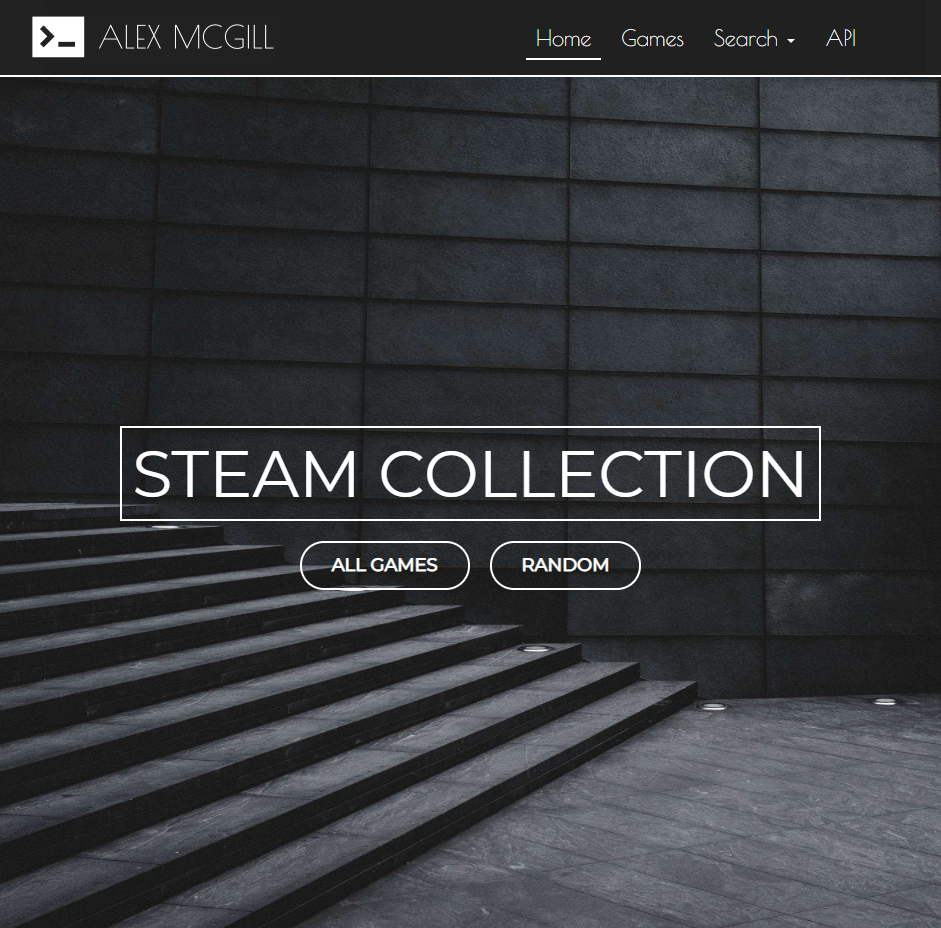
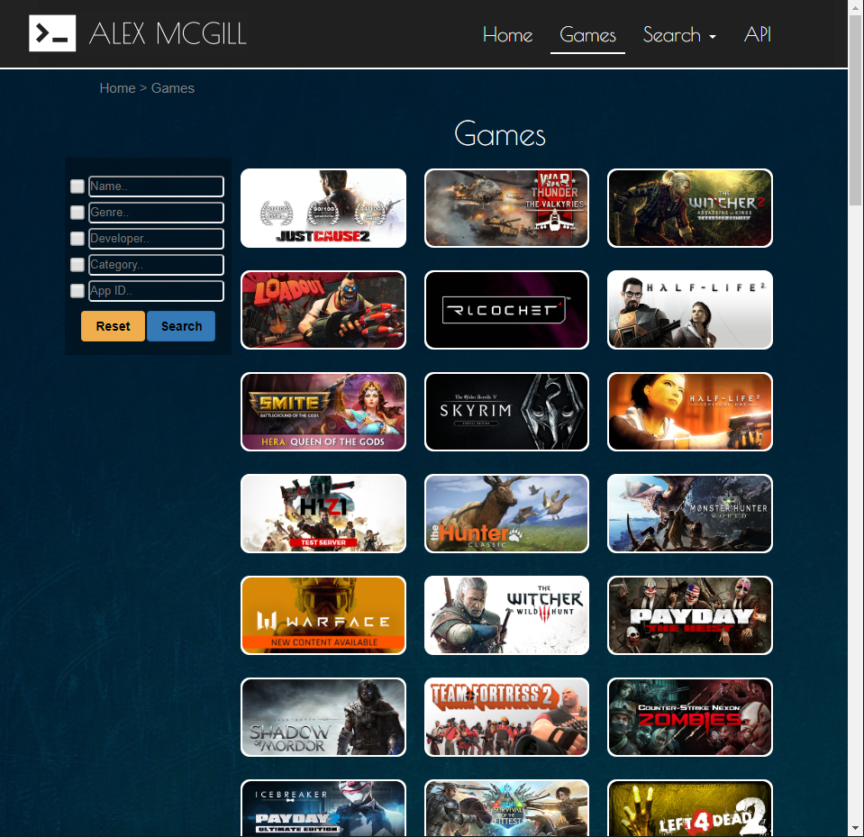
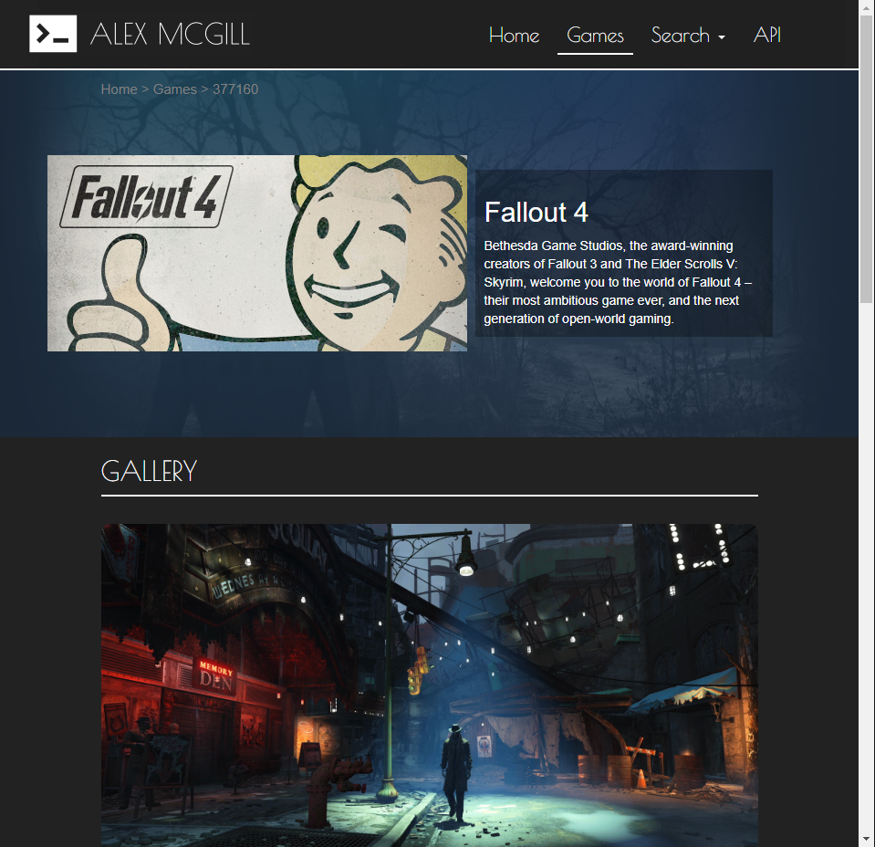
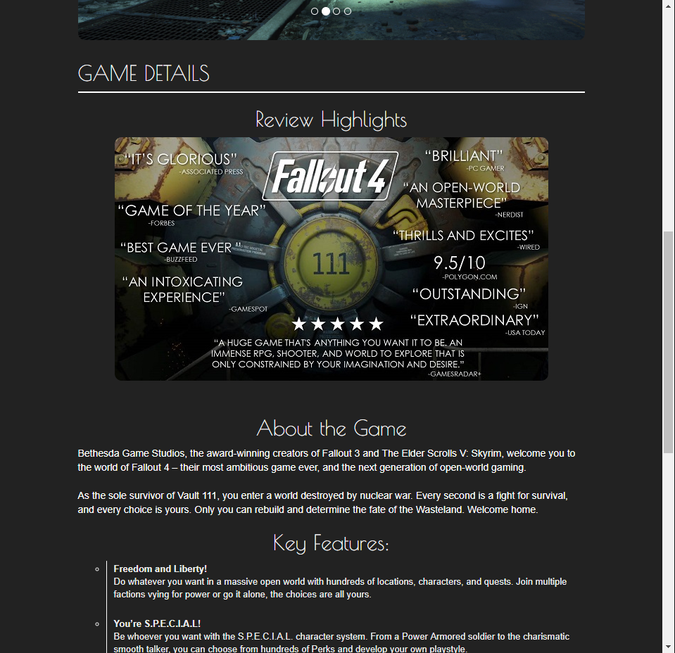
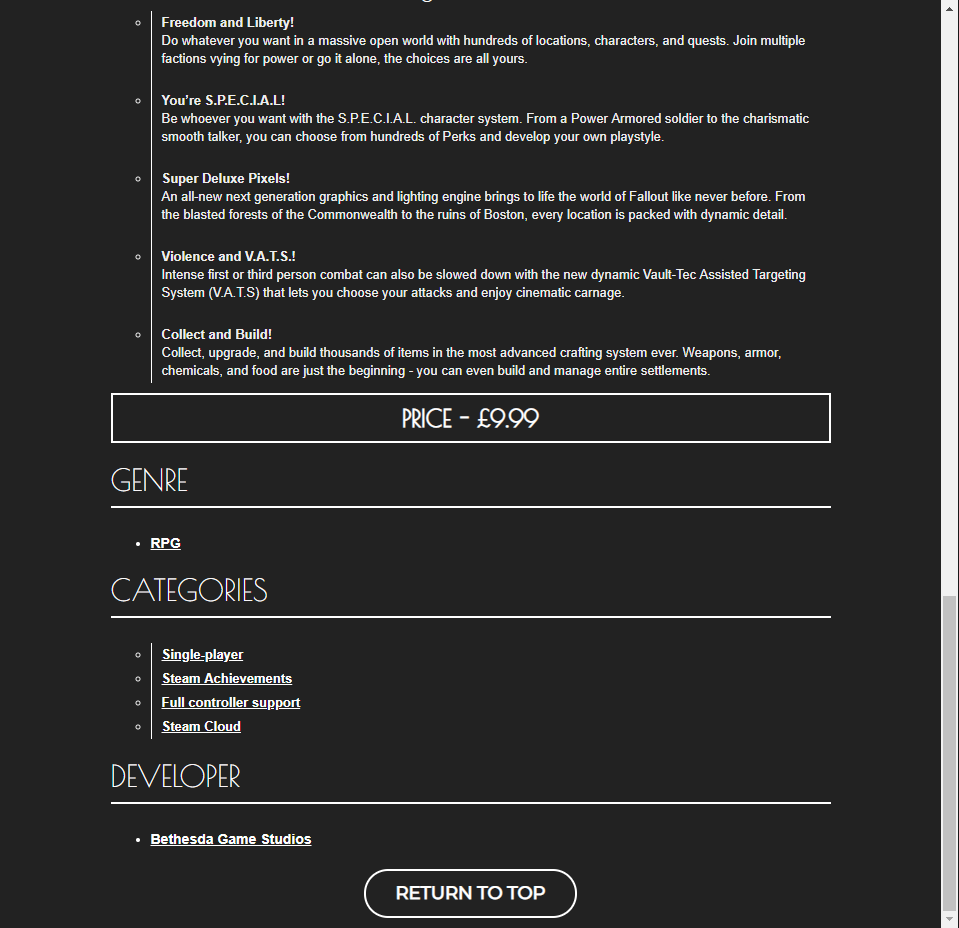
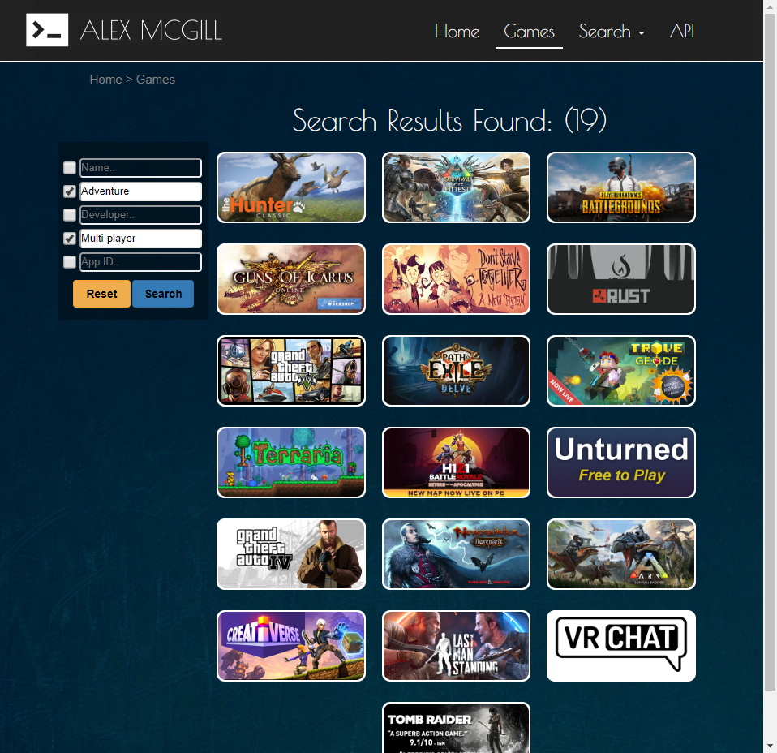
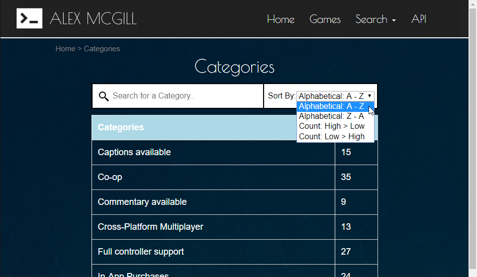
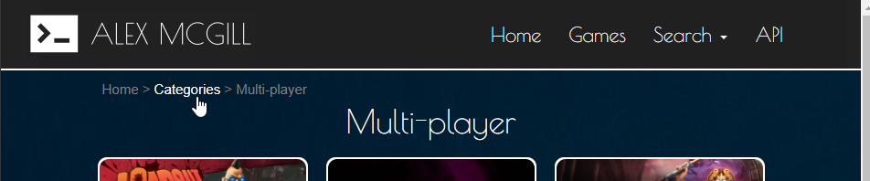
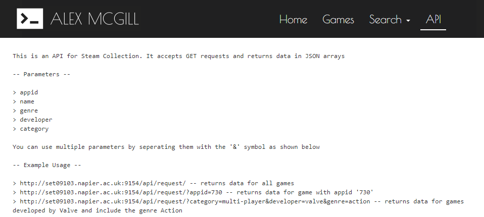
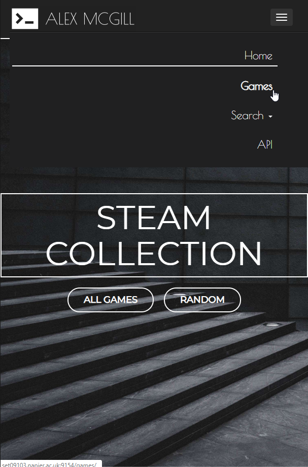

# Steam Collection


## Features

Modern Landing Page:



Game Listing Display & Search Interface:



Game Page:





Search Results:



Genres, Developers & Categories Pages:



Parent Link Hierarchy:



API with Logging:



Responsive Navigation Bar:



## Required Development Setup

* Use the following command to install all the dependencies from 'sourcecode/server/requirements.txt':

```sh
(Python 2.x) > pip install -r requirements.txt 
(Python 3.x) > pip3 install -r requirements.txt

```

## Usage

Once all of the dependencies have been installed:
* Set current directory to <b>/sourcecode/server/</b>
* Enter the command: <b>"export FLASK_APP=boot.py"</b>
* Enter the command: <b>"python -m flask run --host=0.0.0.0 --port 9154"</b>
* Setup complete! You should see the success message as shown in the image below
* Go to http://localhost:9154/ to access the site


![running]


## Meta

Distributed under the [MIT license](https://choosealicense.com/licenses/mit/). See ``LICENSE`` for more information.

Author [@mcgill-a](https://github.com/mcgill-a)

<!-- Markdown link & img dfn's -->
[running]: https://i.imgur.com/1bhDJf1.png
